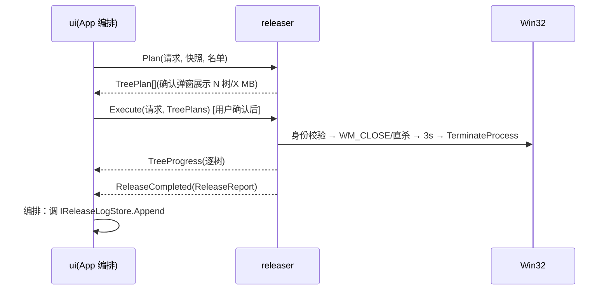

# releaser 模块规格

## 0. 追溯

覆盖需求：R03（一键释放全链路）。上游：[PRD](../../PRD.md)。

## 1. 职责

**管**：勾选项身份校验、进程树构建（含树内存合计）、多树并行两段式结束（优雅→3s→强杀，无窗口项直杀）、取消、逐项结果分类（8 值，见契约）、双释放量计算、释放前后内存采样。
**不管**：确认弹窗呈现（ui）、日志落盘（storage，由 App 编排追加）。

## 2. 领域概念

- **身份校验**：进程名 + 创建时间与快照一致才执行（防 PID 复用杀错，[PRD F3-2](../../PRD.md)）。
- **树保护集**：🚫保护名单 ∪ 白名单，树内跳过其节点及子树（[PRD F3-3](../../PRD.md)）。
- **结果分类映射**：Access Denied 按目标所有者/令牌二分——非当前用户/服务/PPL → NeedsElevation；当前用户非服务 → Blocked（附错误码）（[PRD F3-7](../../PRD.md)）。

## 3. 数据模型

见 [data-contracts.md](../interfaces/data-contracts.md)：`ReleaseRequest`、`TreePlan`（含 `RootPid` 与 `TreePrivateBytes`——确认弹窗"N 树/X MB"的数据源）、`ReleaseItemResult`（Outcome 8 值枚举）、`ReleaseReport`（含 ReleaseId/RequestedAtUtc/LogPersisted）。

## 4. 行为

### 4.1 关键用例
- **规划**：`Task<IReadOnlyList<TreePlan>> Plan(ReleaseRequest, ScanResult, 名单快照)` → 树构建 + 保护集标记 + 树合计内存；结果供确认弹窗展示与 `Execute` 复用（树构建只此一处）。
- **执行**：`Task<ReleaseReport> Execute(ReleaseRequest, TreePlans)` → 多树并行；每树：身份校验 → 优雅（WM_CLOSE，无窗口项跳过）→ 3s → TerminateProcess；前后各采样一次 `MemoryOverview`（经 `IScanner.SampleOverview`）。
- **取消**：`Cancel()` → 跳过未开始的树，进行中的树等待收尾（[PRD F3-5](../../PRD.md)）。

### 4.2 状态机

释放流程状态引用 [PRD §3.6](../../PRD.md)；本模块补**单树执行技术状态**：`Pending → Closing → Waiting(3s) → Killing → Done/Skipped/Failed`，另有 `Pending → Killing` 直达边（无可见窗口条件，[PRD F3-4]）；转换自治，经 `TreeProgress` 外发。

### 4.3 时序图

## 5. 接口依赖

- 提供：`IReleaser`（`Plan`、`Execute`、`Cancel`[随 T-10 接入，T-09 先交 Plan/Execute 与事件]、事件 `TreeProgress`（→ui）、`ReleaseCompleted`（→ui；日志追加由 App 编排调 storage，非本模块直调）。
- 消费：scanner 的 `ScanResult` 与 `SampleOverview`；storage 的保护/白名单名单（经参数注入）。

## 6. 约束（模块级）

- **法**：单树 ≤5s（含 3s 优雅等待）、整批并行 ≤30s（[PRD §3.4](../../PRD.md)）。
- **法**：取消语义 = 跳过未开始 + 等待进行中，不得中断进行中的强杀（防半完成态，[PRD §3.7"释放中关窗"行](../../PRD.md)）。
- **法**：主释放量 = 快照私有提交合计（可归因）；commit 差仅校验值，负值如实输出（[PRD F3-6](../../PRD.md)）。
- **法**：对防软/受保护进程失败如实报错，不得重试死循环（[PRD §3.7](../../PRD.md)）。
