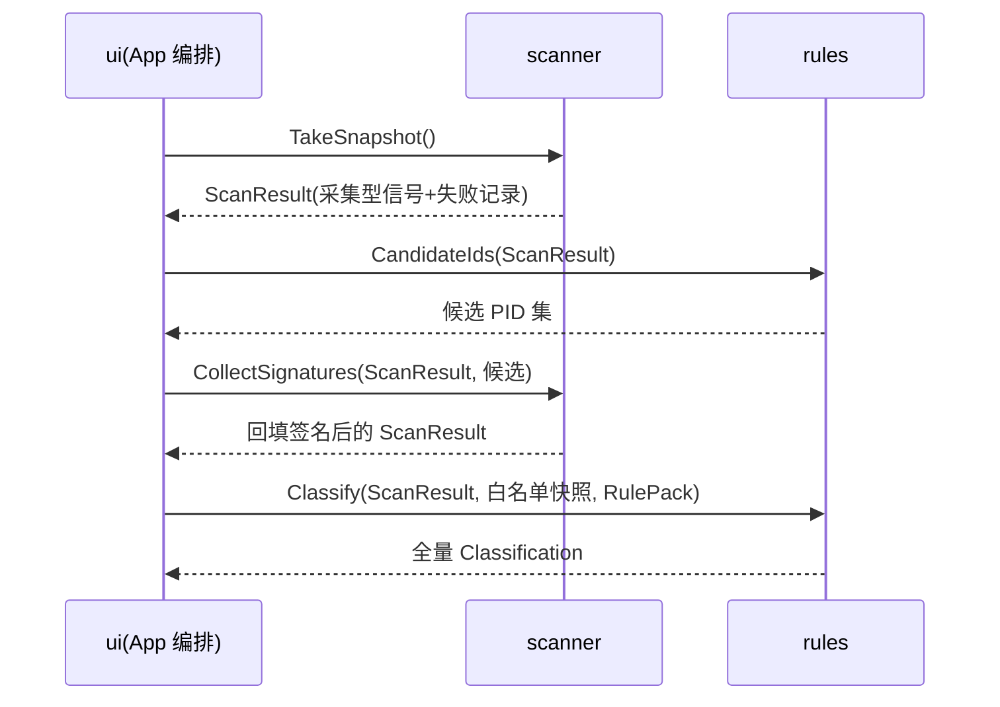

# scanner 模块规格

## 0. 追溯

覆盖需求：R01（快照与信号采集）、R05（内存概览）。上游：[PRD](../../PRD.md)。

## 1. 职责

**管**：进程快照枚举、采集型信号采集（口径表中的原始数据）、候选进程延迟验签（两阶段协议的采集侧）、内存概览三数值采样、来源（自启动四类含条目名）采集。
**不管**：分级判定与名单匹配（rules）、进程结束（releaser）、呈现。

## 2. 领域概念

- **快照（Snapshot）**：一次扫描的完整时点数据集（时点口径，[PRD §3.7"进程集变化"行](../../PRD.md)：单次时点判定，不重试）。
- **采集型信号**：scanner 直接从系统采集的原始数据（见 [data-contracts §1.1 SignalSet](../interfaces/data-contracts.md) 字段级定义）；**名单匹配类判定（残留模式库/常驻/安全软件/白名单命中）不在此列**——归 rules 派生。
- **采集失败（SignalFailure）**：单项信号取不到时显式记录，供 rules 应用保守兜底（system 法-3），不得静默置空。

## 3. 数据模型

见 [interfaces/data-contracts.md](../interfaces/data-contracts.md)：`ProcessSnapshot`、`SignalSet`、`SignalFailure`、`ScanResult`、`MemoryOverview`。

## 4. 行为

### 4.1 关键用例
- **采集快照**：`Task<ScanResult> TakeSnapshot()` → 异步枚举（进程/PPID/私有提交/创建时间/路径/命令行[WMI 通道]/所有者；命令行 WMI 查询与原生枚举重叠执行，编排层决策——WMI 冷启动较慢，重叠缩短采集关键路径）→ 采集型信号按 [PRD 口径表 #1–#15](../../PRD.md) 中属采集侧的项执行（Run 键 WOW64 双视图、QueryServiceConfig2[手写例外，system-spec §4④]、ITaskService[手写例外]等）→ 返回。
- **候选验签（两阶段，法级）**：`Task<ScanResult> CollectSignatures(ScanResult, ISet<int> candidatePids)` → 仅对候选执行 WinVerifyTrust 并回填签名字段（口径表 #9"仅候选执行"；缓存见 §6）。编排方在 `CandidateIds`（rules）之后调用（时序见 §4.3）。
- **采集概览**：`Task<MemoryOverview> SampleOverview()` → 三级通道梯：NtQuerySystemInformation 优先（含 standby）→ PDH 计数器兜底（commit/available/standby）→ GlobalMemoryStatusEx 终底（commit 用页面文件口径近似，Source=Degraded、standby 恒 null）；降级语义：standby 不可得 ⇔ StandbyBytes=null 且 Source=Degraded（T-05 实装，裁决见 [data-contracts §2](../interfaces/data-contracts.md)）。
- **CPU 差分**：扫描窗口首尾两次采样求差（口径表 #7），随快照输出。

### 4.2 状态机

无模块级资源状态机（快照为一次性产物）。

### 4.3 时序图（扫描链，编排方 = App/ui 驱动）

## 5. 接口依赖

- 提供：`IScanner`（`TakeSnapshot`、`CollectSignatures`、`SampleOverview`）。消费者：App（编排）。
- 消费：无（不依赖 storage/名单）。
- 私有：各信号采集器内聚实现，不对外暴露。

## 6. 约束（模块级）

- **法**：采集段预算 ≤2.0s（system §7 端到端 3s 分解的采集份额）；异步不阻塞调用方。
- **法**：除签名验证缓存外不持有跨快照可变状态；**签名验证结果缓存（路径+mtime 键）为例外且必备**（口径表 #9 成本控制与 ≤3s 前提，[PRD §3.4"缓存生效后"]）——缓存仅存验证结论，不存判定结果。
- **法**：SignalFailure 逐项落 ScanResult.Failures（system 法-3 的数据基础）；进程级打开失败（OpenProcess 被拒/进程已消失）按单条记录覆盖路径/创建时间/私有提交/所有者四基础字段，不逐字段重复（data-contracts §2 T-01 裁决③）。
