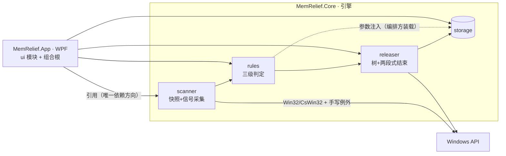

# MemRelief 系统规格（system-spec）

> 上游：[PRD v1.3](../PRD.md)。本层只放全局唯一项（索引 + 全局约束），模块详情见 `modules/`。

## 1. 概述

MemRelief：Windows 单机内存治理工具——扫描进程并按信号规则输出三级推荐（✅/⚠️/🚫），用户多选确认后按进程树两段式安全结束，报告可归因释放量。利益相关者：用户本人（v1 自用）；商用预留（v2）。

## 2. 范围

- 含：采集（scanner）、判定（rules）、释放（releaser）、持久化（storage）、呈现（ui）五模块。
- 不含（引用 [PRD §1.5](../PRD.md) 不做边界，8 条边界展开为 10 项）：自动/定时清理、托盘常驻、开机自启、自启动禁用操作、安装包/签名/更新/遥测/多语言、规则编辑器、工作集修剪、托盘 UIA 枚举、勾选记忆、🚫级强制结束出口。

## 3. 架构总览



依赖方向铁律：`App → Core` 单向；Core 内主链 `scanner → rules → releaser`；**rules 不直接依赖 storage**（白名单/名单由编排方装载后参数注入，保持判定纯函数）；scanner/releaser 可读 storage（仅名单/日志职责见各模块）。候选验签两阶段（scanner↔rules）由编排方驱动，见 §3.1。

### 3.1 组装与接线（组合根 = App）

- App 构造并注入 Core 全部模块；扫描链为**编排调用（拉模式）**：`TakeSnapshot → CandidateIds → CollectSignatures → Classify`（四步由 ui 编排顺序调用，见 [scanner §4.3](./modules/scanner.md)）。
- 事件仅用于异步通知：`TreeProgress`（释放进度）、`ReleaseCompleted`（释放完成）、`ScanFailed`（扫描失败）——同步结果一律走方法返回值，不设冗余事件。
- 日志追加由 App 在 `ReleaseCompleted` 后调 `IReleaseLogStore.Append`（单路径）。
- 线程模型：Core 方法均为异步；事件在后台线程发出，ui 编组到 UI 线程（[ui §6](./modules/ui.md)）。

## 4. 技术栈

- C# / .NET 8（LTS 至 2026-11；**v2 商用前评估升级 .NET 10 LTS**，登记于 §9）；WPF（App）
- Win32 经 CsWin32 源生成器；**手写例外**（不入 CsWin32 口径，[PRD §3.3](../PRD.md)）：①计划任务 ITaskService（COM 激活与 marshaling 控制更直接）②系统内存信息 NtQuerySystemInformation；③他进程命令行采集经 WMI（System.Management，基线采样脚本已验证可行）
- 测试（情报，可择路）：xUnit + coverlet
- 解决方案结构（**多项目，编译期隔离**）：
  ```
  MemRelief.sln
  ├── src/MemRelief.Core/     # scanner/rules/releaser/storage 四模块
  ├── src/MemRelief.App/      # WPF（引用 Core，唯一 UI 项目）
  └── tests/MemRelief.Core.Tests/
  ```
- 发布：单文件自包含便携 exe（App 产出）；数据落用户数据目录

## 5. 模块清单

| 模块 | 职责（一句话） | 规格 | 覆盖需求 |
|---|---|---|---|
| scanner | 采集进程快照与采集型信号、候选验签、内存概览三数值，不做判定 | [modules/scanner.md](./modules/scanner.md) | R01, R05 |
| rules | 对快照应用三级规则与冲突消解（含名单匹配派生判定），纯函数 | [modules/rules.md](./modules/rules.md) | R01, R02 |
| releaser | 校验身份、构建树、两段式结束进程、分类结果，可取消 | [modules/releaser.md](./modules/releaser.md) | R03 |
| storage | 白名单/释放日志/四份内置名单的持久化与轮转 | [modules/storage.md](./modules/storage.md) | R04, R06 |
| ui | WPF 呈现、状态机宿主、组合根与编排，无业务逻辑 | [modules/ui.md](./modules/ui.md) | R01–R06 |

共享数据契约：[interfaces/data-contracts.md](./interfaces/data-contracts.md)。内置名单共 **4 份**（残留模式库/常驻应用/安全软件/系统保护名单，见 [PRD 附录](../PRD.md)）。

## 6. 全局约束

**法**（违反即 FAIL）：
- 法-1 项目依赖方向：`Core` 不得引用 `WindowsBase/PresentationFramework/System.Windows.*`，CI 判定检查 Core **编译产物的程序集引用清单**（防 NuGet 传递引入，非仅 csproj 文本）；`App` 是唯一 UI 项目（溯源：PRD §3.5）。
- 法-2 判定信号技术口径以 [PRD §3.1 F1 口径表 #1–#15](../PRD.md) 为唯一事实源；实现不得另立口径（溯源：req-review S0-1）。
- 法-3 保守兜底总则：任一保护性判定所需数据（信号/名单）采集或加载失败 → 相关进程不得进✅级（溯源：PRD 口径表总则）。
- 法-4 系统配置零写入：除白名单/日志两个自有数据文件（含轮转副本）外不得写注册表/文件系统；引擎诊断日志仅输出调试跟踪/控制台，**不落盘**（溯源：PRD §3.4）。
- 法-5 共享契约变更须先改 `interfaces/data-contracts.md` 再改实现。

**情报**（建议，可择路并记差异）：
- 错误处理建议结果模式（`Result<T, Error>`）承载可预期失败；用户文案归 ui 映射，Core 不含文案（见 §6 情报-1，rules 引用即此条）。
- 诊断日志建议 `Microsoft.Extensions.Logging.Abstractions`（仅抽象包）。
- 事件命名过去式（TreeProgress 除外，表进度）。

## 7. 非功能需求（系统级）

引用 [PRD §3.4](../PRD.md)。**端到端预算分解**（PRD 3s 口径 = 点击"开始扫描"→列表渲染完成，spec 派生分解）：采集 ≤2.0s + 候选验签 ≤0.5s + 判定 ≤0.3s + 渲染 ≤0.2s；模块级法条采用各自份额，不得标注"PRD §3.4 计时口径"。其余：单树 ≤5s/整批 ≤30s、自身工作集 ≤100MB、Win11 x64 实测。Core 全模块可脱离 UI 由 xUnit 驱动（M1 验收形态）；Core 变更行覆盖率 >80%。

## 8. 部署拓扑要点

单文件自包含 exe，免安装；数据文件锚定用户数据目录（提权重启后仍同目录，[PRD §3.4 安全段](../PRD.md)）；无网络依赖。回滚 = 替换旧 exe。

## 9. 变更记录

| 日期 | 变更摘要 | 影响范围 |
|---|---|---|
| 2026-09-05 | 初始版本（新建模式，三层骨架） | 全部 |
| 2026-09-05 | 评审修订：扫描链改拉模式编排（删冗余事件）+组合根节；预算分解（3s 端到端口径澄清）；架构图修正（删 Scanner→Storage 边、rules 参数注入）；名单统一四份；计数修正；法-1 升级为产物级检查；.NET 8 EOL 提示 | system + 全部 modules |

待办：v2 商用前评估 .NET 8（LTS 2026-11 止）升级至 .NET 10 LTS。
